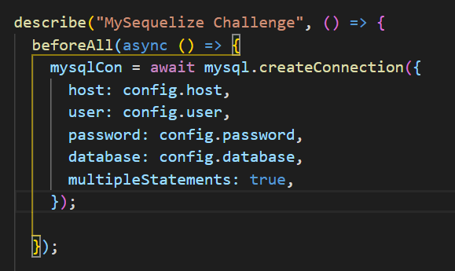
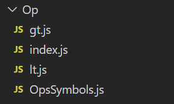
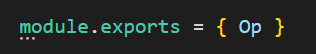
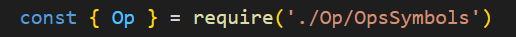
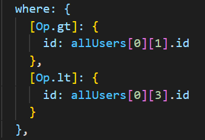
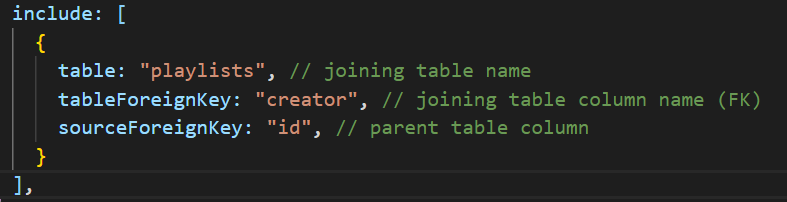
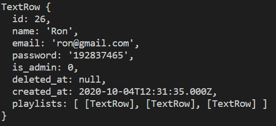

# Challenge-Sequelize

## Description

In this challenge we will be building basic ORM functionallity base on Sequelize using mysql2

--- 

## Main Goal

Implementing the next functions: 

* Insert ()

* BulkInsert ()

* FindAll ()

* FindOne ()

* FindByPk ()

* Update ()

* soft/hard Destroy ()

* Restore ()

---
 
## First Steps

1. Clone template repository

2. Run ``` $npm i ```

3. If you want to run the tests locally, connect to your MySql in the test connection statment, which is located in the ``` beforeAll() ``` in the main test. Enter you password and create empty DB called db_test in your machine.



--- 

## Starting The Challenge

### If you are not famillier with Sequelize syntax:

#### Insert 
``` Model.Insert({... the object containing the value you want to insert}) ```
* [sequelize create reference](https://sequelize.org/master/manual/model-querying-basics.html#simple-insert-queries)
  ##### Related Queries
  * [SQL INSERT Query Reference](https://www.w3schools.com/sql/sql_insert.asp/)

#### Bulk Insert
``` Model.BulkInsert([... array with the objects  you want to insert]) ```
* [sequelize bulk create reference](https://sequelize.org/master/manual/model-querying-basics.html#creating-in-bulk)
  ##### Related Queries
  * [SQL INSERT Query Reference](https://www.w3schools.com/sql/sql_insert.asp/)


#### FindAll 
``` Model.findAll({ ```
     ```... the object containing the select query condition you want to apply}) ```
* [sequelize findAll reference](https://sequelize.org/master/manual/model-querying-basics.html#simple-select-queries)
  ##### Related Queries
  * [SQL SELECT Statement Reference](https://www.w3schools.com/sql/sql_select.asp)
  * [SQL WHERE](https://www.w3schools.com/sql/sql_where.asp/)
  * [SQL ORDER BY](https://www.w3schools.com/sql/sql_orderby.asp/)
  * [SQL LIMIT](https://www.w3schools.com/sql/sql_top.asp/)

#### FindOne
``` Model.FindOne({... the object containing the select query condition you want to apply}) ```
* [sequelize findOne reference](https://sequelize.org/master/manual/model-querying-finders.html#-code-findone--code-)
  ##### Related Queries
  * [SQL SELECT Statement Reference](https://www.w3schools.com/sql/sql_select.asp)
  * [SQL WHERE](https://www.w3schools.com/sql/sql_where.asp/)
  * [SQL ORDER BY](https://www.w3schools.com/sql/sql_orderby.asp/)
  * [SQL LIMIT](https://www.w3schools.com/sql/sql_top.asp/)

#### FindByPK
``` Model.FindByPk(Priority Key) ```
* [sequelize findByPk reference](https://sequelize.org/master/manual/model-querying-finders.html#-code-findbypk--code-)
  ##### Related Queries
  * [SQL SELECT Statement Reference](https://www.w3schools.com/sql/sql_select.asp)
  * [SQL WHERE](https://www.w3schools.com/sql/sql_where.asp/)

#### Update
``` Model.Update({... the object containing the where condition, that you want to update}) ```
* [sequelize updete reference](https://sequelize.org/master/manual/model-querying-basics.html#simple-update-queries)
  ##### Related Queries
  * [SQL UPDATE](https://www.w3schools.com/sql/sql_update.asp)

#### Soft/Hard Destroy 
``` Model.Destroy ({... the object containing the conditions for the rows that you want to delete, to hard delete add force:true}) ```
* [sequelize destroy reference](https://sequelize.org/master/manual/model-querying-basics.html#simple-delete-queries)
* [sequelize paranoid reference](https://sequelize.org/master/manual/paranoid.html)
  ##### Related Queries
  * [SQL DELETE](https://www.w3schools.com/sql/sql_delete.asp)
  * [SQL UPDATE](https://www.w3schools.com/sql/sql_update.asp)

#### Restore
``` Model.Restore ({... the object containing the conditions for the rows that you want to restore}, without object restor all) ``` 
* [sequelize restor reference](https://sequelize.org/master/manual/paranoid.html#restoring)
* [sequelize paranoid reference](https://sequelize.org/master/manual/paranoid.html)
  ##### Related Queries
  * [SQL UPDATE](https://www.w3schools.com/sql/sql_update.asp)


---

## General

### Files and Folders:

## Use The Template!

* main class MySequelize in index.js, which located in the main folder

### Operations:
* folder called 'Op'. inside the folder you must have the file 'OpSymbols.js' (rest of the files is for your decision)


* 'OpSymbols.js' should export the object 'Op', as in the picture



* so we can require it as follow in the test 



* and use it this way (like in sequelize...)




### Include:

* 'include' statment recieves the folowwing parameters:



* 'include' statment should return nested array inside the original object, with key equel to the table name

* ```[TextRow] ``` is a playlist object




---

### Submiting The Challenge

1. The repository must be public and the solution must be in master/main branch

2. Copy the relative url of the repository and paste in the submiting form.


--- 

## Usefull Links
* [SQL Keywords Reference](https://www.w3schools.com/sql/sql_ref_keywords.asp)
* [SQL Queries Reference](https://www.w3schools.com/sql/sql_quickref.asp)


